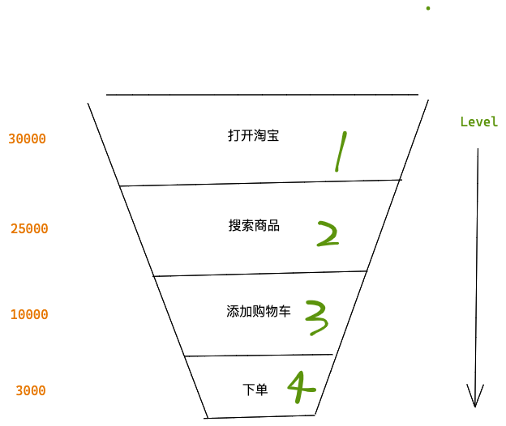
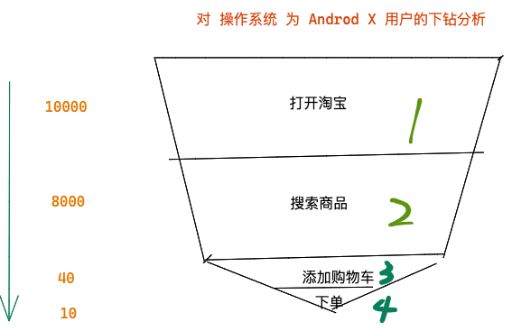
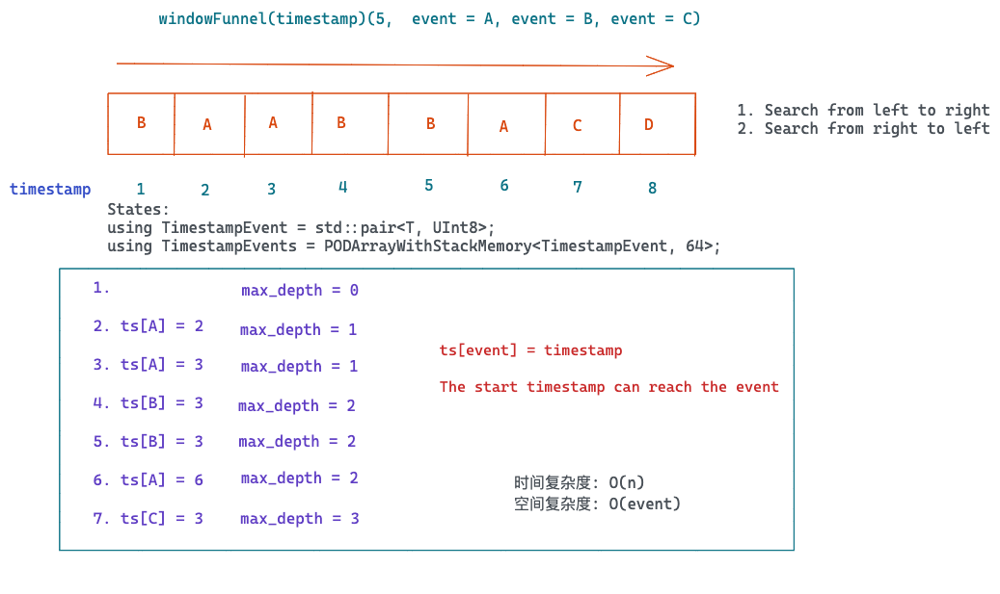

<style>
.row {
  display: flex;
  flex-direction: row;
  flex-wrap: wrap;
  width: 100%;
}

.column {
  display: flex;
  flex-direction: column;
  flex-basis: 100%;
  flex: 1;
}
</style>

## Window Funnel Analytics

- [Introduction](#2)
- [Implementation](#6)
- [Works to do in datafuse](#11)

---
### Introduction


---

### Introduction

- 漏斗分析: 漏斗分析是对用户行为在特定转换路径的转化率分析
- 基于用户行为的分析
- 分组计算量大,状态依赖,窗口限定
- 计算灵活, 路径自由, 支持下钻分析
- 数据分析驱动优化产品设计

---


### Example



---
### Features

- User action independent
- Calculate the max level(depth) the user can reach in a sliding window
- Efficient matching algorithm
- State Merge


---
### Implementation

- Group By -> sort to sorted events
- Aggregating: Window Sequence Matching algorithm
- Aggregating: Merge states


---
### Define the UDAF

```
windowFunnel(timestamp)(window,  condition1, condition2, ....)
```
- timestamp: timestamp integer column
- window: window between the first timestamp and last timestamp
- conditions: boolean values


---
### Example

``` sql
SELECT
    level,
    count() AS c
FROM
(
    SELECT
        user_id,
        windowFunnel(6048000000000000)(timestamp, eventID = 1003,
	 eventID = 1009, eventID = 1007, eventID = 1010) AS level
    FROM trend
    WHERE (event_date >= '2019-01-01') AND
    	  (event_date <= '2019-02-02')
    GROUP BY user_id
)
GROUP BY level
ORDER BY level ASC;
```


---
###  Window Sequence Matching algorithm




---
###  Performance tunning

- Sharing data by uid
	- distributed_group_by_no_merge
	- disable data shuffle

- Indexes
	- pre filter
	- sort key
	- bitmap
- Compressions


---
### Works to do in Datafuse

- Generic Aggregate function to have generic states
	- Like: `using TimestampEvent = std::pair<T, UInt8>;`

- Improve the group by performance
	- Varint hash method for group by queries
	- Arena memory pool (woring on)


